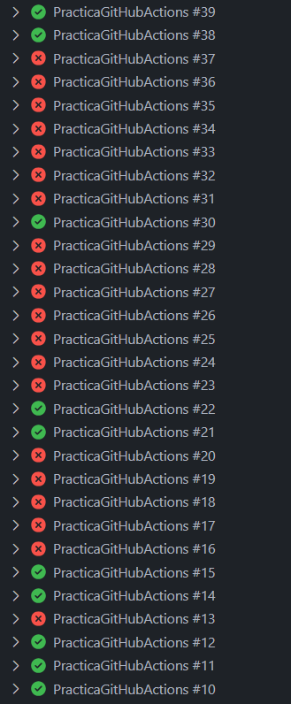

# Práctica GitHub Actions
---
## Descripción
Este repositorio contiene una práctica de GitHub Actions para la asignatura de Despliegue de Aplicaciones Web. Los principales trabajos que se realizan son: 
- Un **linter_job**, que se encarga de ejecutar el linter que ya está instalado en el proyecto para verificar que la sintaxis utilizada es correcta en todos los archivos JavaScript.

- Un **Cypress_job**, que se encarga de ejecutar los tests de Cypress que contiene el proyecto.

- Un **Add_badge_job**, que se encarga de publicar en el README del proyecto el badge que indicará si se han superado los tests de Cypress o no.

- Un **Deploy_job**, que se encarga de publicar el proyecto en la plataforma Vercel.

- Un **Notification_job**, que se encarga de enviar un mensage a telegram con el resultado del workflow ejecutado.


## Indice

- [Proceso de la práctica](#proceso-de-la-práctica)
  - [Inicio de la práctica](#inicio-de-la-práctica)
  - [Linter_job](#linter_job)
  - [Cypress_job](#cypress_job)
  - [Deploy_job](#deploy_job)
  - [Add_badge_job](#add_badge_job)
  - [Metrics_job](#metrics_job)
  - [Notification_job](#notification_job)
- [Historial de todos los test realizados](#historial-de-todos-los-test-realizados)
- [Metricas](#metricas)
- [Resultado test Cypress](#resultado-test-cypress)


## Proceso de la práctica

### Inicio de la práctica 
1. Se ha clonado el repositorio de GitHub que contiene el proyecto Next.js. A continuación, se ha creado un nuevo repositorio en la cuenta de GitHub y se ha subido el código del proyecto clonado.

2. Se ha creado un nuevo workflow de GitHub Actions llamado **PrácticaGitHubActions** en el nuevo repositorio creado. 


3. Para realizar la prácitca más cómodamente, se ha instalado una extensión llamada Guithub Actions en Visual Studio Code.


### Linter_job
El linter job es el que se encarga de ejecutar el linter que ya está instalado en el proyecto para verificar que la sintaxis utilizada es correcta en todos los archivos JavaScript. En caso de que existan errores, deberéis corregirlos hasta que el job se ejecute sin problemas. 

Este es el código del linter_job:

```yml
linter_job:
    runs-on: ubuntu-latest
    steps:
      - name: Checkout code
        uses: actions/checkout@v4

      - name: Install dependencies
        run: npm install

      - name: Run linter
        run: npm run lint
```

Para que este job funcione correctamente, se ha tenido que modificar una seria de archivos como son los siguientes:

Corregir el metodo Get y ordenar los casos del Switch:


#### Resultado Linter_job
Como podemos ver en la imagen, el job en un principio falla, pero tras corregir los errores, el job se ejecuta correctamente.


### Cypress_job
El cypress job es el que se encarga de ejecutar los tests de Cypress que contiene el proyecto. 

Este es el código del cypress_job:

```yml
cypress_job:
    needs: linter_job
    runs-on: ubuntu-latest
    steps:
      - name: Checkout code
        uses: actions/checkout@v4

      - name: Install dependencies
        run: npm install

      - name: Start Next.js server
        run: npm run dev &
        env:
          PORT: 3000

      - name: Wait for server to be ready
        run: npx wait-on http://localhost:3000

      - name: Run Cypress tests
        uses: cypress-io/github-action@v4
        with:
          browser: chrome
          spec: cypress/integration/1-my-tests/**/*.spec.js
        continue-on-error: true

      - name: Save Cypress results to artifact
        run: |
          echo "Saving Cypress results..."
          npx cypress run --spec 'cypress/integration/1-my-tests/**/*.spec.js' > result.txt || echo "Cypress tests failed"
        continue-on-error: true

      - name: Upload Cypress artifact
        uses: actions/upload-artifact@v3
        with:
          name: cypress-results
          path: result.txt
```

#### Resultado Cypress_job
Como podemos ver en la imagen, el job pasa correctamente, junto con el linter_job.


## Deploy_job
El deploy job es el que se encarga de publicar el proyecto en la plataforma Vercel.

Este es el código del deploy_job:

```yml
deploy_job:
    needs: cypress_job
    runs-on: ubuntu-latest
    steps:
      - name: Checkout code
        uses: actions/checkout@v4

      - name: Deploy to Vercel
        uses: amondnet/vercel-action@v20
        with:
          vercel-token: ${{ secrets.VERCEL_TOKEN }}
          github-token: ${{ secrets.TOKENGITHUB }}
          vercel-args: '--prod --yes'
          working-directory: ./
```

#### Proceso de configuración de Vercel
El primer paso ha sido crear una cuenta en Vercel y vincularla con GitHub. A continuación, se ha creado un nuevo proyecto en Vercel y se ha configurado el proyecto de GitHub para que se despliegue automáticamente en Vercel cada vez que se haga un push en la rama main. Para ello se necesita crear un token en Vercel y añadirlo como secreto en el repositorio de GitHub.


 
Tambien es necesario añadir el token de GitHub como secreto en el repositorio de GitHub. Esto se hace para que la acción de Vercel pueda acceder al repositorio de GitHub y desplegar el proyecto en Vercel.


#### Resultado Deploy_job
Como podemos ver en la imagen, el job pasa correctamente, junto con el linter_job y el cypress_job.


Este es el link de Vercel donde se ha desplegado el proyecto: [Vercel](https://practica-github-actions-bx705j54j-diegos-projects-9ecbf589.vercel.app/)


### Add_badge_job
El add badge job es el que se encarga de publicar en el README del proyecto el badge que indicará si se han superado los tests de Cypress o no.

Este es el código del add_badge_job:

```yml
add_badge_job:
    needs: cypress_job
    runs-on: ubuntu-latest
    steps:
      - name: Checkout code
        uses: actions/checkout@v4
        with:
          token: ${{ secrets.TOKENGITHUB }}
          fetch-depth: 0

      - name: Download Cypress artifact
        uses: actions/download-artifact@v3
        with:
          name: cypress-results

      - name: Determine Cypress result
        id: read_result
        run: |
          if grep -q "failure" result.txt; then
            echo "CYPRESS_OUTCOME=failure" >> $GITHUB_ENV
          else
            echo "CYPRESS_OUTCOME=success" >> $GITHUB_ENV
          fi

      - name: Update README with badge
        run: |
          awk '/## Resultados de los Últimos Tests/ {print; print ($CYPRESS_OUTCOME == "failure" ? "" : ""); next} 1' README.md > temp.md && mv temp.md README.md


          git config --global user.email "llorens19@example.com"
          git config --global user.name "llorens19"
          git add README.md
          git commit -m "Update README.md with Cypress test results" || echo "No changes to commit"
          git fetch origin main
          git rebase origin/main || (git rebase --abort && echo "Rebase failed; skipping rebase")
          git push origin main || echo "Push failed; skipping push"
```

#### Resultado Add_badge_job
Como podemos ver en la imagen, el job pasa correctamente, junto con el linter_job, el cypress_job y el deploy_job.


### Metrics_job
El metrics job es el que se encarga de configurar en el README personal una action que permita mostrar métricas de los lenguajes más utilizados en los proyectos de vuestro perfil de GitHub.

Este es el código del metrics_job:

```yml
metrics_job:
    needs: cypress_job
    runs-on: ubuntu-latest
    steps:
      - name: Checkout personal repository
        uses: actions/checkout@v4
        with:
          token: ${{ secrets.TOKENGITHUB }}

      - name: Generate GitHub metrics
        uses: lowlighter/metrics@latest
        with:
          filename: github-metrics.svg
          token: ${{ secrets.TOKENGITHUB }}
          base: repositories          
          template: classic           
          config_timezone: Europe/Madrid 

      - name: Update README with metrics
        run: |
          echo "Updating README.md with metrics..."
          awk '/## Resultados de Métricas/ {print; print ""; next} 1' README.md > temp.md && mv temp.md README.md


          git config --global user.email "llorenssorianodiego@gmail.com"
          git config --global user.name "llorens19"
          git add README.md
          git commit -m "Update README.md with static GitHub metrics" || echo "No changes to commit"
          git fetch origin main
          git rebase origin/main || (git rebase --abort && echo "Rebase failed; skipping rebase")
          git push origin main || echo "Push failed; skipping push"
```

#### Configuración de la action de métricas
Para configurar la action de métricas, se ha necesita añadir un secreto en el repositorio de GitHub con el nombre de TOKENGITHUB y el valor del token de GitHub además de añadir el usuario de GitHub en el código de la action. Para dar permisos de escritura a lowlighter/metrics, se ha tenido que realizar la siguiente configuración en el perfil de GitHub:


Finalmente, en el readme se ha añadido el siguiente código para que se muestren las métricas en el README:

```md
  
```

### Notification_job
El notification job es el que se encarga de enviar un correo con el resultado del workflow ejecutado. Esto se ha realizado mediante un mensaje en Telegram que mandará un bot.

Este es el código del notification_job:

```yml
  notification_job:
    needs: [linter_job, cypress_job, add_badge_job, deploy_job, metrics_job]
    runs-on: ubuntu-latest
    if: always()
    steps:
      - name: Send Telegram Notification
        run: |
          echo "Preparing Telegram notification..."
          JOB_RESULTS="Estado de los trabajos :\n\n"
          JOB_RESULTS+=" - linter_job: ${{ needs.linter_job.result }}\n"
          JOB_RESULTS+=" - cypress_job: ${{ needs.cypress_job.result }}\n"
          JOB_RESULTS+=" - add_badge_job: ${{ needs.add_badge_job.result }}\n"
          JOB_RESULTS+=" - deploy_job: ${{ needs.deploy_job.result }}\n"
          JOB_RESULTS+=" - metrics_job: ${{ needs.metrics_job.result }}\n"
          curl -s -X POST "https://api.telegram.org/bot${{ secrets.TELEGRAM_TOKEN }}/sendMessage" \
            -d chat_id=${{ secrets.TELEGRAM_CHAT_ID }} \
            -d text="$(echo -e "$JOB_RESULTS")"

```

#### Configuración de la action de notificación
Para configurar la action de notificación, se ha necesita añadir un secreto en el repositorio de GitHub con el nombre de TELEGRAM_TOKEN y el valor del token de Telegram además de añadir el chat_id de Telegram en el código de la action.

Esto se hace desde talegram con el bot botFather, donde se crea un bot y se obtiene el token y el chat_id. Luego con el bot que has creado, se le manda un mensaje y se obtiene el chat_id.

#### Resultado Notification_job
Como podemos ver en la imagen, el job pasa correctamente, junto con el linter_job, el cypress_job, el add_badge_job, el deploy_job y el metrics_job y se envía un mensaje a Telegram con el resultado de los trabajos.


## Historial de todos los test realizados




## Metricas


## Resultado test Cypress

